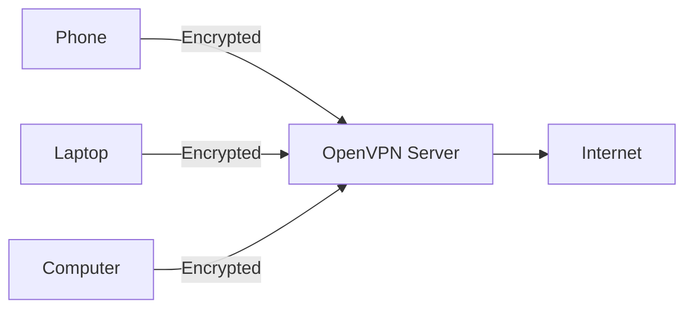

# openvpn-install


[](https://saythanks.io/to/angristan)

OpenVPN installer for Debian, Ubuntu, Fedora, CentOS, Arch Linux, Oracle Linux, Rocky Linux and AlmaLinux.

This script will let you setup your own secure VPN server in just a few seconds.

You can also check out [wireguard-install](https://github.com/angristan/wireguard-install), a simple installer for a simpler, safer, faster and more modern VPN protocol.

## What is this?

This script is meant to be run on your own server, whether it's a VPS or a dedicated server, or even a computer at home.

Once set up, you will be able to generate client configuration files for every device you want to connect.

Each client will be able to route its internet traffic through the server, fully encrypted.



## Usage

First, get the script and make it executable:

```bash
curl -O https://raw.githubusercontent.com/angristan/openvpn-install/master/openvpn-install.sh
chmod +x openvpn-install.sh
```

Then run it:

```sh
./openvpn-install.sh
```

You need to run the script as root and have the TUN module enabled.

The first time you run it, you'll have to follow the assistant and answer a few questions to setup your VPN server.

When OpenVPN is installed, you can run the script again, and you will get the choice to:

- Add a client
- Remove a client
- Uninstall OpenVPN

In your home directory, you will have `.ovpn` files. These are the client configuration files. Download them from your server and connect using your favorite OpenVPN client.

If you have any question, head to the [FAQ](#faq) first. And if you need help, you can open a [discussion](https://github.com/angristan/openvpn-install/discussions). Please search existing issues and dicussions first.

### Headless install

It's also possible to run the script headless, e.g. without waiting for user input, in an automated manner.

Example usage:

```bash
AUTO_INSTALL=y ./openvpn-install.sh

# or

export AUTO_INSTALL=y
./openvpn-install.sh
```

A default set of variables will then be set, by passing the need for user input.

If you want to customise your installation, you can export them or specify them on the same line, as shown above.

- `APPROVE_INSTALL=y`
- `APPROVE_IP=y`
- `IPV6_SUPPORT=n`
- `PORT_CHOICE=1`
- `PROTOCOL_CHOICE=1`
- `DNS=1`
- `COMPRESSION_ENABLED=n`
- `CUSTOMIZE_ENC=n`
- `CLIENT=clientname`
- `PASS=1`

If the server is behind NAT, you can specify its endpoint with the `ENDPOINT` variable. If the endpoint is the public IP address which it is behind, you can use `ENDPOINT=$(curl -4 ifconfig.co)` (the script will default to this). The endpoint can be an IPv4 or a domain.

Other variables can be set depending on your choice (encryption, compression). You can search for them in the `installQuestions()` function of the script.

Password-protected clients are not supported by the headless installation method since user input is expected by Easy-RSA.

The headless install is more-or-less idempotent, in that it has been made safe to run multiple times with the same parameters, e.g. by a state provisioner like Ansible/Terraform/Salt/Chef/Puppet. It will only install and regenerate the Easy-RSA PKI if it doesn't already exist, and it will only install OpenVPN and other upstream dependencies if OpenVPN isn't already installed. It will recreate all local config and re-generate the client file on each headless run.

### Headless User Addition

It's also possible to automate the addition of a new user. Here, the key is to provide the (string) value of the `MENU_OPTION` variable along with the remaining mandatory variables before invoking the script.

The following Bash script adds a new user `foo` to an existing OpenVPN configuration

```bash
#!/bin/bash
export MENU_OPTION="1"
export CLIENT="foo"
export PASS="1"
./openvpn-install.sh
```

## Features

- Installs and configures a ready-to-use OpenVPN server
- Iptables rules and forwarding managed in a seamless way
- If needed, the script can cleanly remove OpenVPN, including configuration and iptables rules
- Customisable encryption settings, enhanced default settings (see [Security and Encryption](#security-and-encryption) below)
- OpenVPN 2.4 features, mainly encryption improvements (see [Security and Encryption](#security-and-encryption) below)
- Variety of DNS resolvers to be pushed to the clients
- Choice to use a self-hosted resolver with Unbound (supports already existing Unbound installations)
- Choice between TCP and UDP
- NATed IPv6 support
- Compression disabled by default to prevent VORACLE. LZ4 (v1/v2) and LZ0 algorithms available otherwise.
- Unprivileged mode: run as `nobody`/`nogroup`
- Block DNS leaks on Windows 10
- Randomised server certificate name
- Choice to protect clients with a password (private key encryption)
- Many other little things!

## Compatibility

The script supports these Linux distributions:

|                        | Support |
| ---------------------- | ------- |
| AlmaLinux 8            | ✅      |
| Amazon Linux 2         | ✅      |
| Amazon Linux >= 2023.6 | ✅      |
| Arch Linux             | ✅      |
| CentOS 7               | ✅      |
| CentOS Stream >= 8     | ✅ 🤖   |
| Debian >= 10           | ✅ 🤖   |
| Fedora >= 35           | ✅ 🤖   |
| Oracle Linux 8         | ✅      |
| Rocky Linux 8          | ✅      |
| Ubuntu >= 18.04        | ✅ 🤖   |

To be noted:

- The script is regularly tested against the distributions marked with a 🤖 only.
  - It's only tested on `amd64` architecture.
- It should work on older versions such as Debian 8+, Ubuntu 16.04+ and previous Fedora releases. But versions not in the table above are not officially supported.
  - It should also support versions between the LTS versions, but these are not tested.
- The script requires `systemd`.
