Cấu hình wifi ARUBA
--------
## Bước 1
1/ Bắt mạng Wifi : SetMeUp-C7:76"44 (Bắt wifi bất kỳ)
2/ Sử dụng Scan IP Address để lấy địa chỉ IP của Aruba
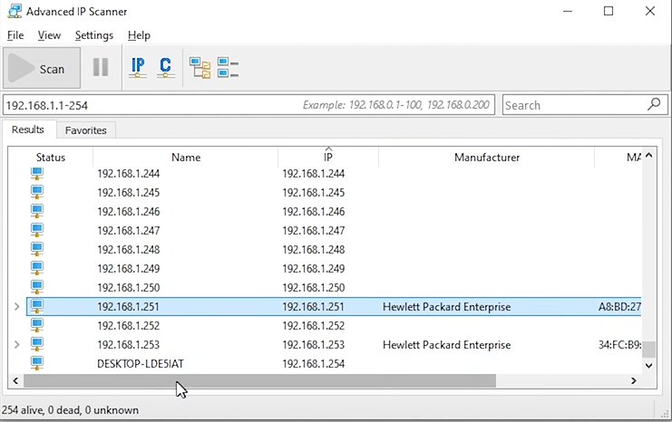

---
## Bước 2
Đăng nhập 
- Username: admin
- Password: admin

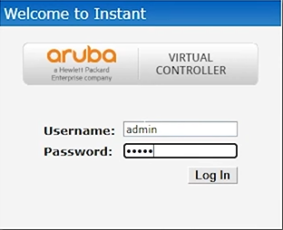

Chọn Region Việt Nam
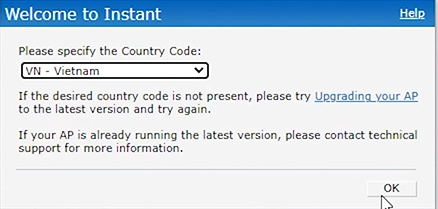

---
## Bước 3: 
Tạo SSID
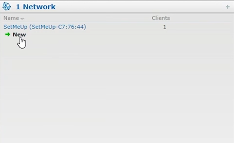
Bấm vào chữ: New

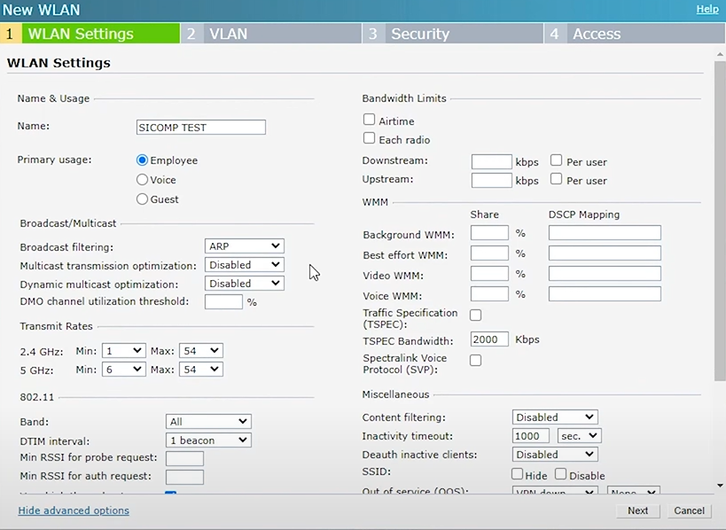
Đặt tên Network (Đây không phải là tên Wifi)
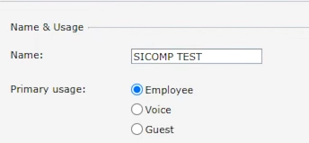

Đặt tên cho Wifi 
- ESSID: (Tên wifi)

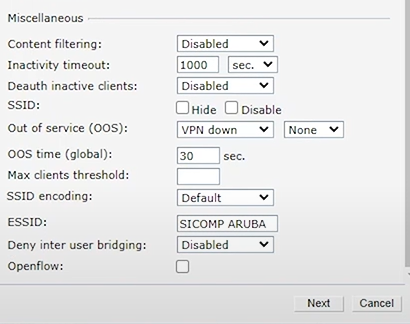

- Next 

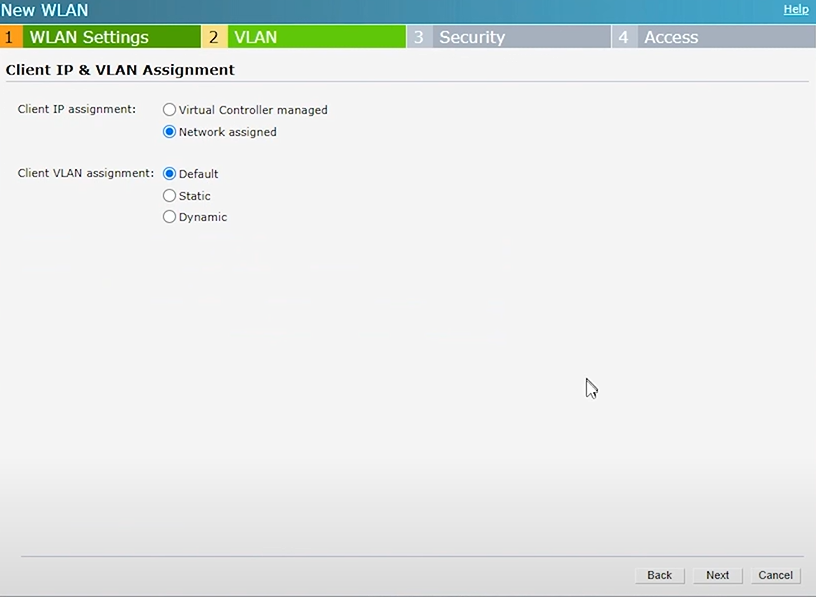

---
## Bước 4:
- Passphrase: Đặt mật khẩu cho Wifi

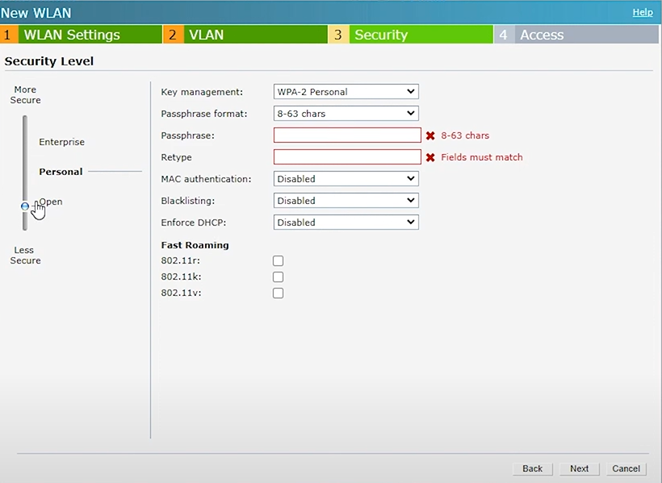

Tích chọn hết phần này:
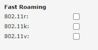

- Next
- Finish

---
## Bước 4:
Đặt tên Wifi thành Wifi chính, đặt lại địa chỉ IP tính
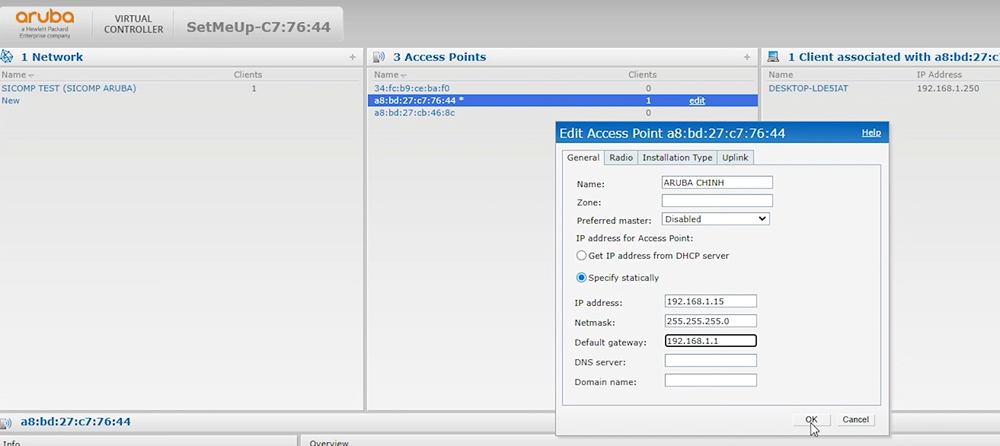